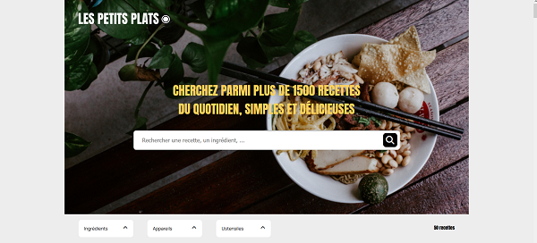
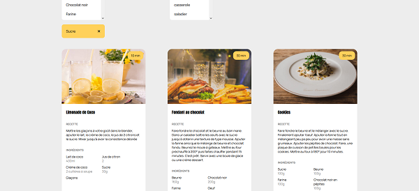
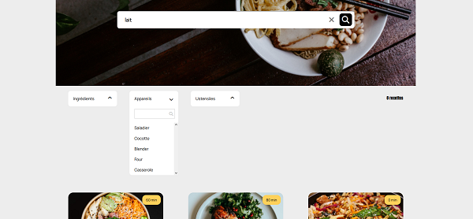

# Les petits plats Front-End


## Description

Les Petits Plats is a website that helps you find your next recipe to cook. With its search options, it's easy to sort available recipes based on your preferences.

Front-End project focused on search and filtering fetures. It has two branches: one using native programming and the other using JavaScript functional programming.

## Stack

- HTML
- CSS
- JS Vanilla

## Check it

[Les-petits-plats](https://yacine-di.github.io/Les-petits-plats.github.io/)
## Installation

Just clone the project and run it on LiveServer

```bash
  git clone https://github.com/Yacine-Di/Les-petits-plats.github.io.git
```

## Lessons Learned

During this project I learned how to filter data.

## Screenshots

Home page <br>


Photographer page <br>


Video modal <br>


## Authors

[Yacine D](https://github.com/Yacine-Di)